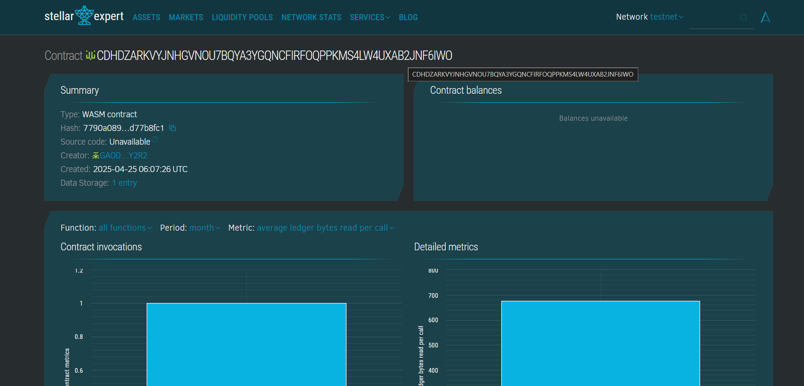

# Fitness App with AR

## Project Description
The *Fitness App with AR* is a decentralized fitness tracking system that leverages Augmented Reality (AR) and blockchain to deliver immersive workout experiences. It ensures secure data logging and management using Soroban smart contracts.

## Project Vision
Our vision is to integrate AR with fitness routines, making workouts more engaging and interactive while ensuring transparency and immutability of user workout data on the blockchain.

## Key Features
- *User Registration:* Create a secure profile on-chain.
- *Workout Logging:* Log AR-assisted workout sessions with accurate calorie tracking.
- *Immutable Data:* Workout history and stats are securely stored and tamper-proof.
- *Transparency:* All updates and logs are verifiable and permanent.

## Future Scope
- *AR NFT Gear Integration:* Introduce tokenized AR gear for enhanced experiences.
- *Leaderboards & Challenges:* Social fitness competitions and gamification.
- *Multi-Device Sync:* Seamless integration with AR glasses and fitness wearables.
- *Health Data Sharing:* Optional secure sharing with healthcare providers.

## contract detail 
CDHDZARKVYJNHGVNOU7BQYA3YGQNCFIRFOQPPKMS4LW4UXAB2JNF6IWO
